# 自动化测试平台 - 用户使用手册

> 版本：v2.0  
> 更新日期：2026-05-04

---

## 目录

1. [快速入门](#第一章-快速入门)
2. [服务器管理](#第二章-服务器管理)
3. [脚本管理](#第三章-脚本管理)
4. [任务管理](#第四章-任务管理)
5. [本地执行](#第五章-本地执行)
6. [流水线编排](#第六章-流水线编排)
7. [结果管理](#第七章-结果管理)
8. [系统配置](#第八章-系统配置)
9. [附录](#附录)

---

## 第一章 快速入门

### 1.1 系统概述

#### 产品简介

自动化测试管理平台是一个轻量级的测试管理系统，专为测试工程师设计，帮助您：

- 📁 **集中管理测试脚本**：统一存储、版本控制、参数化配置
- 🖥️ **管理测试服务器**：服务器分组、状态监控、SSH终端
- ⚡ **高效执行测试**：多服务器并行执行、实时日志、定时任务
- 📊 **自动化结果收集**：结果解析、判定规则、报告导出

#### 核心功能一览

| 功能模块 | 说明 |
|----------|------|
| 服务器管理 | 添加、分组、监控、WebShell终端 |
| 脚本管理 | 脚本上传、版本管理、参数配置、多步骤定义 |
| 任务管理 | 创建任务、选择服务器、配置参数、定时执行 |
| 流水线编排 | 多任务编排、依赖配置、DAG执行 |
| 结果管理 | 结果查看、对比分析、报告导出 |

#### 技术架构

```
┌─────────────────────────────────────────────────────────────┐
│                        用户界面 (Vue 3)                       │
├─────────────────────────────────────────────────────────────┤
│                        API 网关层                             │
├──────────────┬──────────────┬──────────────┬────────────────┤
│  服务器管理   │   脚本管理    │   任务管理    │   结果管理     │
├──────────────┴──────────────┴──────────────┴────────────────┤
│                      业务逻辑层 (Spring Boot)                  │
├─────────────────────────────────────────────────────────────┤
│   SSH执行器   │   本地执行器   │   定时调度器   │   结果解析器   │
├─────────────────────────────────────────────────────────────┤
│                      数据存储层 (SQLite)                       │
└─────────────────────────────────────────────────────────────┘
```

### 1.2 环境准备

#### 系统要求

| 项目 | 要求 |
|------|------|
| Java运行环境 | JDK 17 或更高版本 |
| 内存 | 建议 2GB 以上 |
| 磁盘空间 | 建议 1GB 以上（用于存储脚本和结果） |
| 操作系统 | Windows / Linux / macOS |

#### 快速启动

**方式一：直接运行 JAR 包**

```bash
# 下载并运行
java -jar auto-test-platform-1.0.0-SNAPSHOT.jar

# 访问系统
# 浏览器打开 http://localhost:8080
```

**方式二：指定端口运行**

```bash
java -jar auto-test-platform-1.0.0-SNAPSHOT.jar --server.port=9000
```

#### 首次访问

1. 打开浏览器，访问 `http://localhost:8080`
2. 系统默认无需登录，直接进入主界面

> **截图**：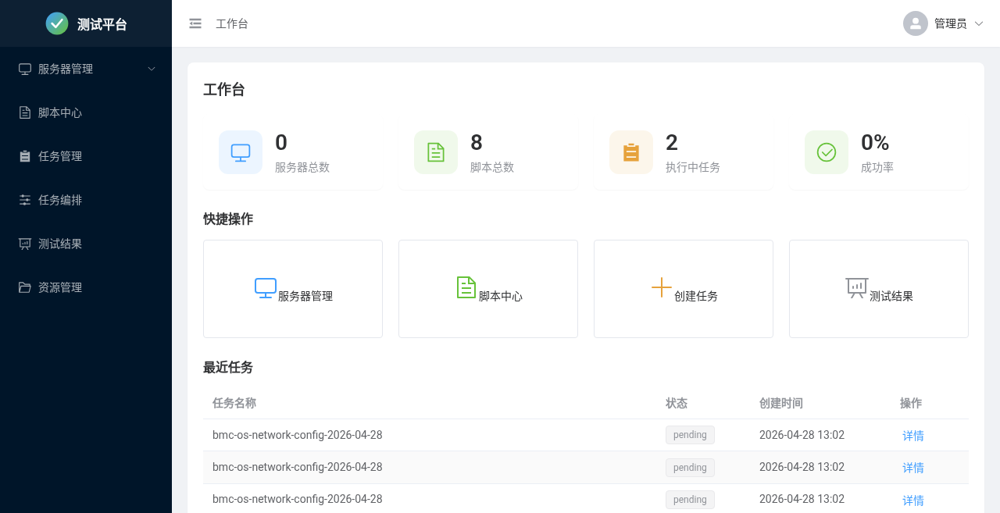

### 1.3 五分钟上手

#### 步骤一：添加服务器

1. 点击左侧菜单 **「服务器管理」**
2. 点击 **「添加服务器」** 按钮
3. 填写服务器信息：
   - 名称：如 `测试服务器1`
   - 主机地址：如 `192.168.1.100`
   - SSH端口：默认 `22`
   - 用户名：登录用户名
   - 密码或私钥：选择一种认证方式
4. 点击 **「测试连接」** 验证配置
5. 点击 **「保存」**

> 📸 **截图位置**：添加服务器表单截图

#### 步骤二：导入脚本

1. 点击左侧菜单 **「脚本管理」**
2. 点击 **「新建脚本」** 按钮
3. 填写基本信息：
   - 名称：如 `系统信息检查`
   - 类型：Shell / Python
   - 分类：选择测试类型
4. 上传脚本文件（或直接编写）
5. 配置参数（可选）
6. 点击 **「保存」**

> **截图**：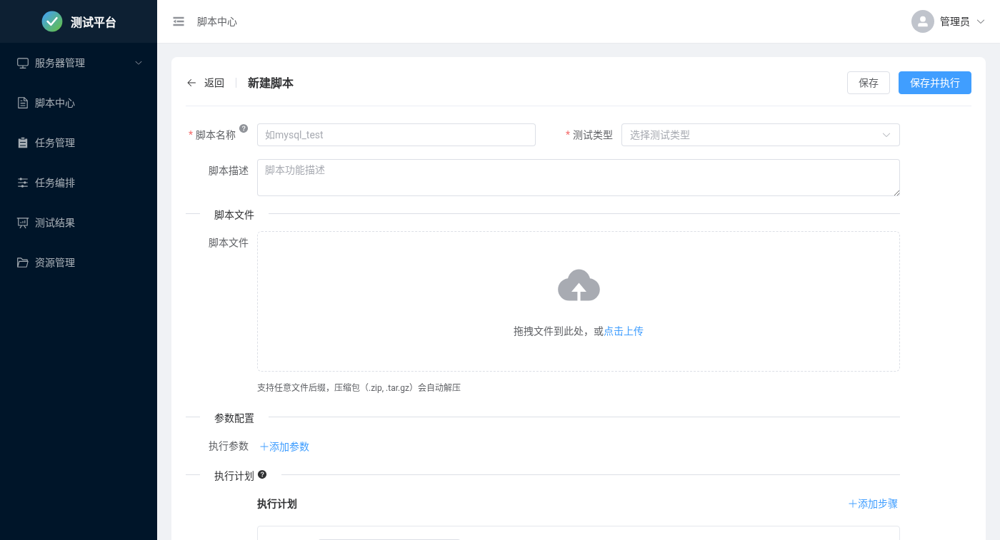

#### 步骤三：创建并执行任务

1. 点击左侧菜单 **「任务管理」**
2. 点击 **「创建任务」** 按钮
3. 按向导完成配置：
   - **选择脚本**：从列表选择已创建的脚本
   - **选择服务器**：勾选要执行的服务器
   - **配置参数**：设置脚本参数值
   - **执行设置**：选择「立即执行」
4. 点击 **「创建任务」**
5. 自动跳转到任务详情页，查看实时执行状态

> **截图**：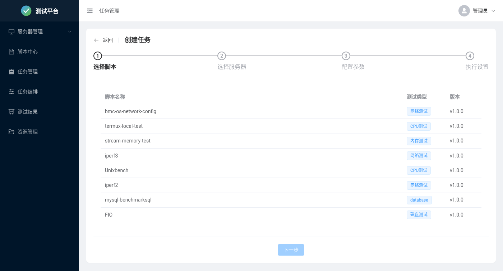

#### 步骤四：查看结果

1. 在任务详情页查看执行进度
2. 点击 **「日志」** 标签查看实时输出
3. 执行完成后，点击 **「结果」** 标签查看解析结果
4. 可点击 **「导出报告」** 下载测试报告

> 📸 **截图位置**：任务详情页截图

---

## 第二章 服务器管理

### 2.1 服务器列表

#### 功能说明

服务器列表页面展示所有已添加的测试服务器，您可以：

- 查看服务器状态（在线/离线）
- 搜索和筛选服务器
- 启用/禁用服务器
- 批量操作

#### 状态说明

| 状态 | 说明 |
|------|------|
| 🟢 在线 | 服务器连接正常，可执行任务 |
| 🔴 离线 | 服务器无法连接 |
| ⚪ 禁用 | 服务器已被禁用，不参与任务执行 |

> **截图**：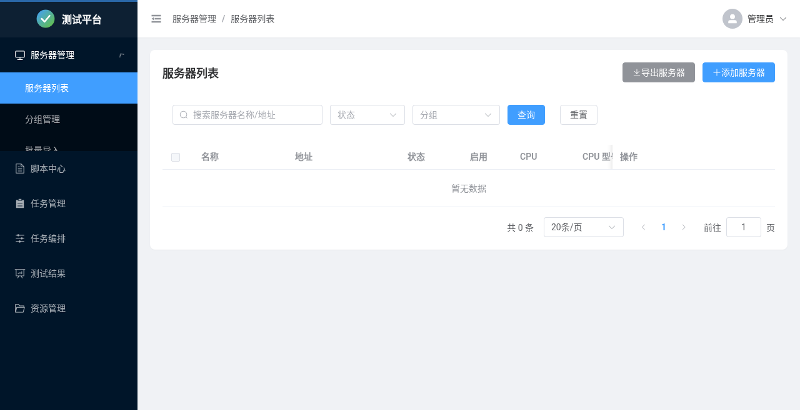

#### 搜索与筛选

- **搜索框**：输入服务器名称或IP地址进行模糊搜索
- **状态筛选**：点击状态标签筛选特定状态的服务器
- **分组筛选**：选择分组查看该分组下的服务器

### 2.2 添加服务器

#### 单台添加

1. 点击 **「添加服务器」** 按钮
2. 填写服务器信息：

| 字段 | 说明 | 必填 |
|------|------|------|
| 名称 | 服务器显示名称 | ✅ |
| 主机地址 | IP地址或域名 | ✅ |
| SSH端口 | SSH服务端口，默认22 | ✅ |
| 用户名 | SSH登录用户名 | ✅ |
| 认证方式 | 密码 或 SSH私钥 | ✅ |
| 密码 | 选择密码认证时填写 | 条件必填 |
| 私钥 | 选择私钥认证时上传 | 条件必填 |
| 分组 | 所属服务器分组 | ❌ |
| 描述 | 备注信息 | ❌ |

3. 点击 **「测试连接」** 验证配置是否正确
4. 点击 **「保存」** 完成添加

> **截图**：

#### 批量导入

当需要添加大量服务器时，可使用 Excel 批量导入功能：

1. 点击 **「批量导入」** 按钮
2. 下载导入模板
3. 按模板格式填写服务器信息
4. 上传填写好的 Excel 文件
5. 预览导入数据，确认无误后点击 **「确认导入」**

**Excel 模板格式：**

| 名称 | 主机地址 | 端口 | 用户名 | 密码 | 分组 |
|------|----------|------|--------|------|------|
| 服务器1 | 192.168.1.101 | 22 | root | password | 生产环境 |
| 服务器2 | 192.168.1.102 | 22 | root | password | 测试环境 |

> **截图**：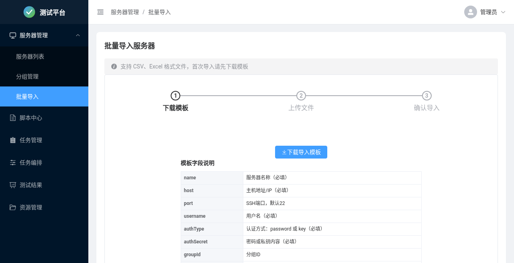

### 2.3 服务器分组

#### 功能说明

服务器分组帮助您按环境、用途等维度组织服务器，便于管理和任务分配。

#### 创建分组

1. 进入 **「服务器分组」** 页面
2. 点击 **「新建分组」**
3. 输入分组名称和描述
4. 点击 **「保存」**

#### 管理分组

- **编辑**：修改分组名称和描述
- **删除**：删除分组（服务器不会被删除）
- **移动服务器**：将服务器分配到不同分组

> **截图**：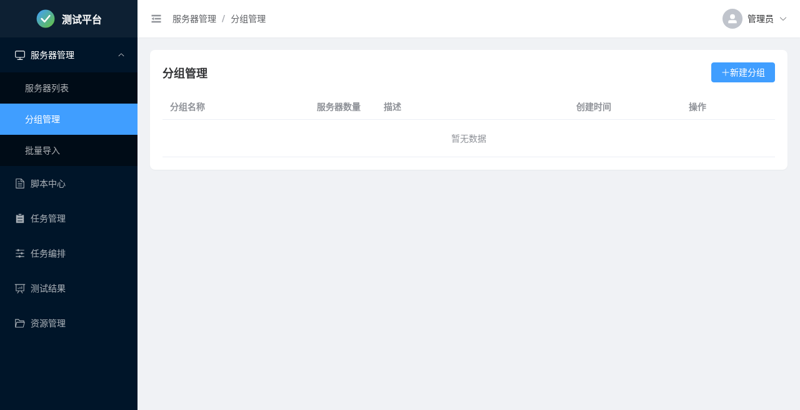

### 2.4 WebShell 终端

#### 功能说明

WebShell 提供网页版的 SSH 终端，无需安装额外工具即可直接操作服务器。

#### 使用方法

1. 在服务器列表中，点击服务器的 **「终端」** 按钮
2. 新标签页打开 WebShell 终端
3. 自动登录服务器，可直接执行命令

> 📸 **截图位置**：WebShell 终端截图

#### 注意事项

- 终端会话超时时间为 30 分钟
- 关闭浏览器标签页会自动断开连接
- 支持常用快捷键和命令历史

---

## 第三章 脚本管理

### 3.1 脚本列表

#### 功能说明

脚本列表展示所有已创建的测试脚本，支持：

- 按名称、分类搜索
- 查看脚本版本
- 快速创建任务
- 编辑、删除脚本

#### 列表信息

| 列 | 说明 |
|------|------|
| 名称 | 脚本名称 |
| 类型 | Shell / Python |
| 分类 | CPU测试、内存测试、磁盘测试等 |
| 当前版本 | 最新发布的版本号 |
| 创建时间 | 脚本创建时间 |
| 操作 | 编辑、创建任务、删除 |

> **截图**：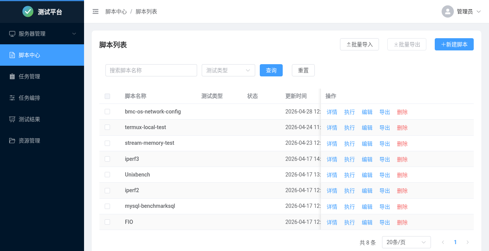

### 3.2 创建脚本

#### 基本信息

点击 **「新建脚本」** 进入创建页面：

| 字段 | 说明 | 必填 |
|------|------|------|
| 名称 | 脚本唯一标识名称 | ✅ |
| 描述 | 脚本功能说明 | ❌ |
| 类型 | Shell 或 Python | ✅ |
| 分类 | 测试类型分类 | ❌ |
| 超时时间 | 默认执行超时时间（秒） | ❌ |

> **截图**：

#### 脚本文件

**方式一：上传文件**

- 支持 `.sh`、`.py` 文件
- 文件大小限制 10MB

**方式二：在线编写**

- 在代码编辑器中直接编写脚本内容
- 支持语法高亮

> 📸 **截图位置**：脚本编辑器截图

### 3.3 脚本配置详解

#### autotest.yaml 配置

脚本的配置信息存储在 `autotest.yaml` 文件中，包含：

```yaml
# 基本信息
name: my_script
description: 脚本功能描述
type: shell
category: network
timeout: 600

# 参数定义
parameters:
  - name: SIZE
    type: string
    default: "10G"
    description: 测试数据大小

# 步骤定义（多步骤脚本）
steps:
  step_1:
    displayName: "部署环境"
    script: deploy.sh
    dependsOn: []
  step_2:
    displayName: "执行测试"
    script: test.sh
    dependsOn: ["step_1"]

# 结果解析规则
resultRules:
  - name: "检查成功"
    type: keyword
    pattern: "SUCCESS"
    expected: true
```

#### 参数类型

| 类型 | 说明 | 示例 |
|------|------|------|
| string | 字符串 | "hello" |
| number | 数字 | 100 |
| boolean | 布尔值 | true / false |
| select | 下拉选择 | ["option1", "option2"] |

### 3.4 步骤配置

#### 功能说明

复杂测试场景可能需要多个步骤按顺序执行，如：部署 → 测试 → 清理。

#### 步骤定义

每个步骤包含：

| 属性 | 说明 |
|------|------|
| 名称 | 步骤唯一标识 |
| 显示名称 | 界面显示的名称 |
| 脚本 | 该步骤执行的脚本文件 |
| 依赖 | 执行前需要完成的其他步骤 |
| 参数 | 该步骤的专属参数 |

> 📸 **截图位置**：步骤配置界面截图

#### 执行顺序

- **无依赖**：可并行执行
- **有依赖**：等待依赖步骤完成后执行

### 3.5 资源文件管理

#### 功能说明

对于测试所需的大文件（如测试数据、配置文件等），可使用资源文件功能统一管理。

#### 添加资源

1. 进入脚本编辑页面
2. 点击 **「资源文件」** 标签
3. 上传资源文件
4. 配置目标路径和权限

| 字段 | 说明 |
|------|------|
| 资源文件 | 要上传的文件 |
| 目标路径 | 服务器上的存放路径 |
| 文件权限 | 如 644、755 |

> 📸 **截图位置**：资源文件配置截图

#### 资源分发

任务执行时，资源文件会自动上传到目标服务器的指定路径。

### 3.6 脚本版本管理

#### 版本操作

- **创建新版本**：基于当前版本创建新版本
- **版本对比**：查看不同版本的差异
- **切换版本**：恢复到历史版本
- **发布版本**：将版本标记为正式版本

> 📸 **截图位置**：版本管理界面截图

---

## 第四章 任务管理

### 4.1 任务列表

#### 功能说明

任务列表展示所有测试任务的执行记录，支持：

- 查看任务状态
- 搜索和筛选
- 批量操作

#### 任务状态

| 状态 | 说明 |
|------|------|
| ⏳ 待执行 | 任务已创建，等待执行 |
| 🔄 执行中 | 任务正在执行 |
| ✅ 成功 | 任务执行成功 |
| ❌ 失败 | 任务执行失败 |
| ⏸️ 已取消 | 任务被手动取消 |

> **截图**：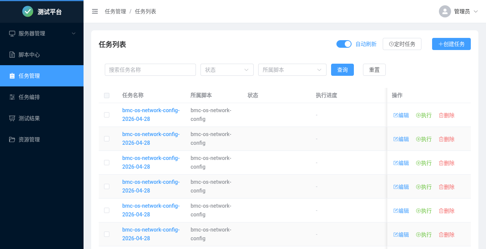

### 4.2 创建任务

#### 向导步骤

**步骤一：选择脚本**

- 从脚本列表中选择要执行的脚本
- 选择脚本版本

> 📸 **截图位置**：选择脚本步骤截图

**步骤二：选择服务器**

- 为每个步骤选择执行服务器
- 可选择「本地环境」进行本地执行
- 支持配置步骤参数

> 📸 **截图位置**：选择服务器步骤截图

**步骤三：配置参数**

- 设置脚本的共享参数值
- 使用内置参数：`TASK_ID`、`SCRIPT_ID`、`SERVER_ID` 等

> 📸 **截图位置**：配置参数步骤截图

**步骤四：执行设置**

| 执行模式 | 说明 |
|----------|------|
| 立即执行 | 创建后立即开始执行 |
| 指定时间 | 在指定时间自动执行 |
| 周期执行 | 按 Cron 表达式周期执行 |

> 📸 **截图位置**：执行设置步骤截图

### 4.3 任务详情

#### 执行概览

展示任务的整体执行情况：

- 任务基本信息
- 执行进度
- 各服务器执行状态

> 📸 **截图位置**：任务概览截图

#### 步骤进度

多步骤任务展示每个步骤的执行状态：

- 步骤名称和状态
- 执行时间
- 依赖关系图

> 📸 **截图位置**：步骤进度截图

#### 实时日志

- WebSocket 实时推送执行日志
- 按步骤/服务器筛选日志
- 支持日志搜索

> 📸 **截图位置**：实时日志截图

#### 结果分析

执行完成后展示：

- 结果状态（成功/失败）
- 解析后的结构化数据
- 性能指标

> 📸 **截图位置**：结果分析截图

### 4.4 任务操作

| 操作 | 说明 |
|------|------|
| 取消任务 | 终止正在执行的任务 |
| 重试任务 | 重新执行失败的任务 |
| 复制任务 | 基于当前任务创建新任务 |
| 删除任务 | 删除任务记录 |

### 4.5 定时任务

#### 创建定时任务

1. 创建任务时选择「周期执行」
2. 输入 Cron 表达式
3. 系统自动按周期创建任务实例

#### Cron 表达式说明

```
┌───────────── 秒 (0-59)
│ ┌───────────── 分钟 (0-59)
│ │ ┌───────────── 小时 (0-23)
│ │ │ ┌───────────── 日期 (1-31)
│ │ │ │ ┌───────────── 月份 (1-12)
│ │ │ │ │ ┌───────────── 星期 (0-7, 0和7都是周日)
│ │ │ │ │ │
* * * * * *
```

**常用示例：**

| 表达式 | 说明 |
|--------|------|
| `0 0 2 * * ?` | 每天凌晨2点 |
| `0 0 */6 * * ?` | 每6小时 |
| `0 30 9 * * MON-FRI` | 工作日上午9:30 |
| `0 0 0 1 * ?` | 每月1号零点 |

#### 管理定时任务

进入 **「定时任务」** 页面：

- 查看所有定时任务
- 启用/禁用定时任务
- 修改执行时间
- 删除定时任务

> **截图**：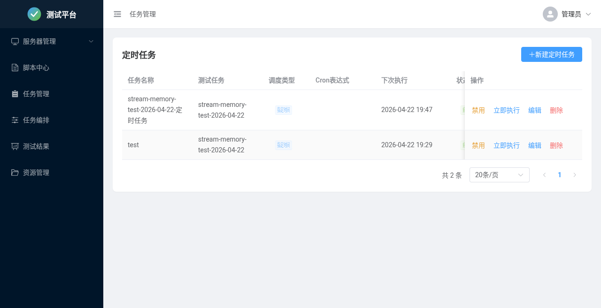

---

## 第五章 本地执行

### 5.1 什么是本地执行

#### 概念说明

| 执行方式 | 执行位置 | serverId | 适用场景 |
|----------|----------|----------|----------|
| 远程执行 | 目标服务器 | 正整数 (1, 2, 3...) | 直接在目标服务器执行命令 |
| 本地执行 | 平台服务器 | **-1** | 需要本地工具连接目标服务器 |

#### 适用场景

| 场景 | 说明 |
|------|------|
| SOL 连接 | 通过 SOL (Serial Over LAN) 连接目标服务器 BMC |
| IPMI 管理 | 使用本地 ipmitool 管理远程设备 |
| 本地 SSH | 从平台发起 SSH 连接到目标服务器 |
| API 测试 | 从平台调用远程 API 接口 |
| 使用本地工具 | 依赖平台服务器上的特定工具或环境 |

### 5.2 配置本地执行

#### 选择本地环境

在任务创建的「选择服务器」步骤：

1. 在服务器下拉框中选择 **「⭐ 本地环境」**
2. 该步骤将在平台服务器本地执行

> 📸 **截图位置**：选择本地环境截图

#### 参数配置

本地执行的脚本通常需要额外参数来指定目标：

- 目标 IP 地址
- 连接用户名/密码
- 其他连接参数

### 5.3 注意事项

| 项目 | 说明 |
|------|------|
| 后台执行 | 本地执行不支持后台运行选项 |
| 超时设置 | 注意设置合理的超时时间 |
| 权限要求 | 确保平台有执行相关工具的权限 |

---

## 第六章 流水线编排

### 6.1 流水线概述

#### 功能说明

流水线功能允许将多个测试脚本组合成一个编排，按照依赖关系自动执行。

#### 核心概念

| 概念 | 说明 |
|------|------|
| 编排（Pipeline） | 多个任务的集合，定义执行策略 |
| 任务（PipelineTask） | 编排中的单个测试任务 |
| 依赖关系 | 任务之间的执行顺序约束 |
| 执行记录（PipelineRun） | 每次执行生成的记录 |

#### 使用场景

- 多个测试脚本需要按顺序执行
- 测试流程有前置依赖（如环境准备）
- 需要定期执行一组测试

### 6.2 创建流水线

#### 基本信息

1. 点击 **「新建流水线」**
2. 填写基本信息：

| 字段 | 说明 |
|------|------|
| 名称 | 流水线名称 |
| 描述 | 功能说明 |
| 最大并行数 | 同时执行的任务数量上限 |

> **截图**：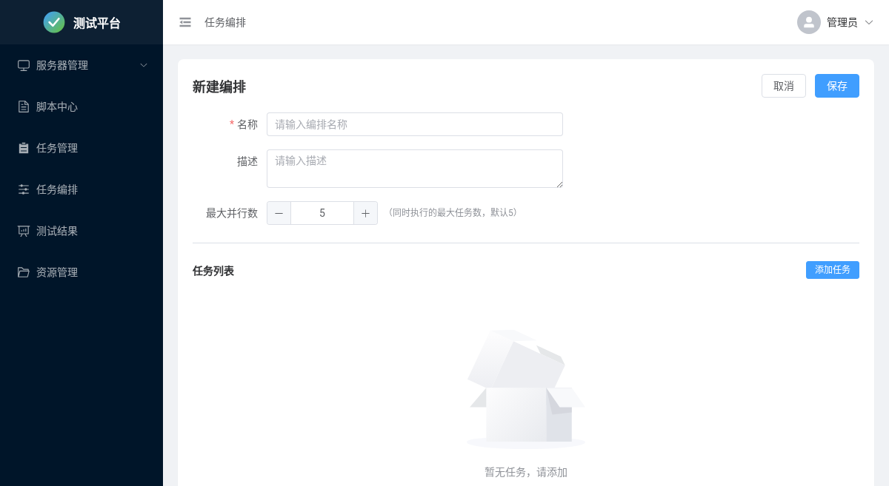

#### 添加任务

1. 点击 **「添加任务」**
2. 选择要执行的脚本
3. 配置服务器和参数
4. 设置依赖关系（可选）

> 📸 **截图位置**：添加流水线任务截图

#### 依赖配置

任务可以依赖其他任务：

- 依赖的任务执行成功后，当前任务才会开始
- 无依赖的任务可以并行执行

### 6.3 执行流水线

#### 手动触发

1. 在流水线列表找到目标流水线
2. 点击 **「执行」** 按钮
3. 系统创建执行记录并开始执行

#### 查看执行状态

- **执行列表**：查看所有执行记录
- **执行详情**：查看每个任务的执行状态
- **DAG 图**：可视化展示任务依赖关系和执行进度

> **截图**：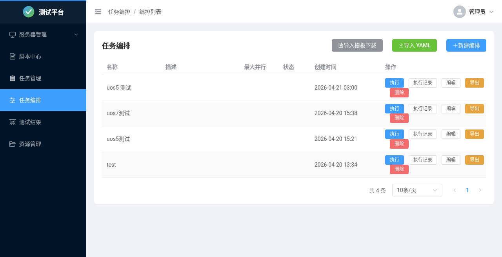

### 6.4 流水线管理

| 操作 | 说明 |
|------|------|
| 编辑 | 修改流水线配置 |
| 启用/禁用 | 控制流水线是否可执行 |
| 删除 | 删除流水线 |

---

## 第七章 结果管理

### 7.1 结果列表

#### 功能说明

结果列表展示所有任务的执行结果，支持：

- 按状态筛选
- 按时间范围查询
- 按脚本/服务器筛选

#### 结果状态

| 状态 | 说明 |
|------|------|
| ✅ 成功 | 测试通过 |
| ❌ 失败 | 测试失败 |
| ⚠️ 部分成功 | 多服务器执行时部分成功 |

> **截图**：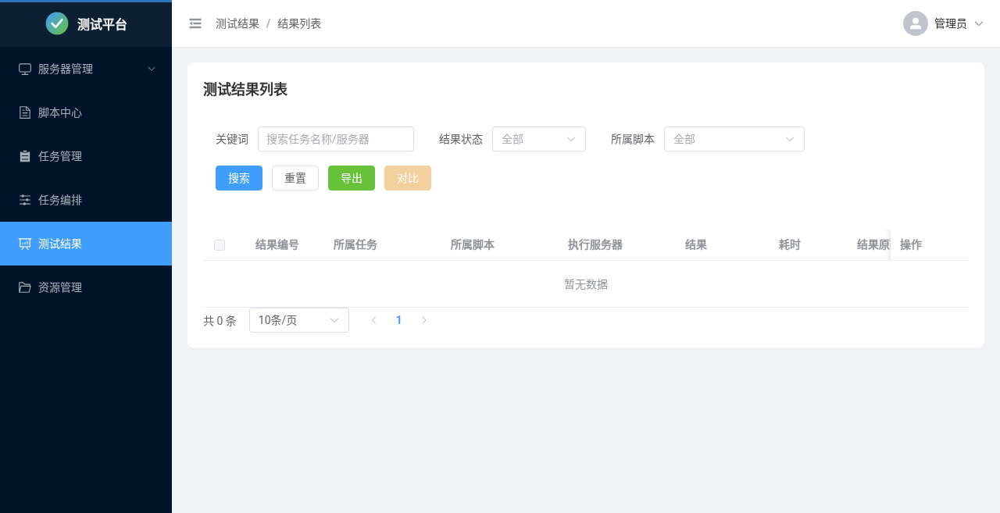

### 7.2 结果详情

#### 执行信息

- 任务名称和脚本
- 执行时间
- 执行服务器
- 参数配置

> 📸 **截图位置**：结果详情-执行信息截图

#### 输出日志

- 完整的执行日志
- 支持搜索和高亮
- 可下载日志文件

> 📸 **截图位置**：结果详情-日志截图

#### 解析结果

- 脚本输出的结构化解析结果
- 按预定义规则提取的关键数据
- JSON 格式展示

> 📸 **截图位置**：结果详情-解析结果截图

### 7.3 结果对比

#### 功能说明

对比多次测试结果，发现性能变化趋势。

#### 使用方法

1. 在结果列表勾选要对比的结果（最多5个）
2. 点击 **「对比」** 按钮
3. 查看对比分析页面

> 📸 **截图位置**：结果对比页面截图

#### 对比内容

- 执行时间对比
- 关键指标对比
- 性能趋势图表

### 7.4 报告导出

#### 导出格式

- **HTML**：网页格式，可直接在浏览器查看
- **PDF**：文档格式，适合存档和分享

#### 报告内容

- 任务基本信息
- 执行环境
- 测试结果
- 性能数据
- 日志摘要

---

## 第八章 系统配置

### 8.1 应用配置

#### 配置文件位置

`application.yml` 或启动参数

#### 主要配置项

```yaml
server:
  port: 8080                    # 服务端口

autotest:
  storage:
    scripts-path: ~/auto-test/scripts     # 脚本存储路径
    reports-path: ~/auto-test/reports     # 报告存储路径
    temp-path: ~/auto-test/temp           # 临时文件路径
    results-path: ~/auto-test/results     # 结果文件路径
  
  ssh:
    connect-timeout: 30000      # SSH连接超时（毫秒）
    exec-timeout: 3600000       # 命令执行超时（毫秒）
  
  task:
    default-timeout: 3600       # 任务默认超时（秒）
```

#### 启动参数示例

```bash
# 指定端口
java -jar app.jar --server.port=9000

# 指定数据库路径
java -jar app.jar --spring.datasource.url="jdbc:sqlite:/data/test.db"
```

### 8.2 数据备份

#### 备份数据库

```bash
# 数据库文件位置
~/.autotest/test_platform.db

# 备份命令
cp ~/.autotest/test_platform.db backup_$(date +%Y%m%d).db
```

#### 恢复数据

```bash
# 停止服务
# 恢复数据库
cp backup_20260504.db ~/.autotest/test_platform.db
# 重启服务
```

### 8.3 日志管理

#### 日志位置

- **应用日志**：`app.log`（启动目录）
- **任务执行日志**：数据库存储

#### 日志级别

在 `application.yml` 中配置：

```yaml
logging:
  level:
    root: INFO
    com.autotest: DEBUG
```

---

## 附录

### A. FAQ 常见问题

**Q1: 如何修改默认端口？**

```bash
java -jar app.jar --server.port=9000
```

**Q2: SSH 连接失败怎么办？**

检查：
- 目标服务器 SSH 服务是否运行
- 防火墙是否开放 22 端口
- 用户名密码是否正确
- 网络是否可达（ping 测试）

**Q3: 任务执行超时如何处理？**

- 增加任务超时时间设置
- 检查脚本是否有死循环
- 检查服务器资源是否充足

**Q4: 如何查看详细错误信息？**

- 查看任务详情页的日志
- 查看应用日志文件 `app.log`

### B. 错误码对照表

| 错误码 | 说明 | 解决方案 |
|--------|------|----------|
| E001 | SSH连接失败 | 检查网络和认证信息 |
| E002 | 脚本执行超时 | 增加超时时间 |
| E003 | 服务器离线 | 检查服务器状态 |
| E004 | 脚本文件不存在 | 检查脚本配置 |

### C. 快捷键说明

| 快捷键 | 功能 |
|--------|------|
| `Ctrl + K` | 全局搜索 |
| `Ctrl + Enter` | 提交表单 |
| `Esc` | 关闭弹窗 |

### D. 术语表

| 术语 | 说明 |
|------|------|
| 脚本 | 可执行的测试程序 |
| 任务 | 脚本的一次执行实例 |
| 步骤 | 测试流程中的执行单元 |
| 流水线 | 多个任务的编排集合 |
| WebShell | 网页版 SSH 终端 |
| Cron | 定时任务表达式 |

---

*文档版本：v2.0*  
*最后更新：2026-05-04*

---

## 截图补充说明

本文档已包含以下截图：

| 截图名称 | 文件 |
|----------|------|
| 首页界面 | homepage.png |
| 服务器列表 | servers-list.png |
| 添加服务器 | servers-create.png |
| 批量导入 | servers-import.png |
| 服务器分组 | servers-groups.png |
| 脚本列表 | scripts-list.png |
| 创建脚本 | scripts-create.png |
| 任务列表 | tasks-list.png |
| 创建任务 | tasks-create.png |
| 定时任务 | tasks-scheduled.png |
| 流水线列表 | pipelines-list.png |
| 创建流水线 | pipelines-create.png |
| 结果列表 | results-list.png |

**待补充截图**（需要有测试数据的环境）：
- 任务详情页（执行概览、步骤进度、实时日志）
- 结果详情页（执行信息、日志、解析结果）
- WebShell 终端
- 创建任务向导各步骤
- 结果对比页面
